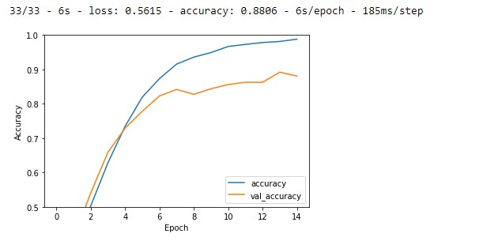

---
# Projet IA Embarqué
   ### Ayoub BELHOUARI & Elie DAHER
   #### 18-10-2022
---

# Introduction

Ce projet décrit l'implémentation d'un modèle de réseaux neurone basés sur la base de donnée Salinebottle sur UNE carte STM Discovery (STM32L4R9). Il contient l'archive du projet et les scripts python pour construire le modèle et communiquer avec la carte. 
L'objectif c'est de detecter le niveau de liquide (chloride de sodium) dans les boteilles pour la surveillance du niveau de remplissage avec une IA embarquée.

# Datasets

La dataset a été fournit par ST,elle contient des photos des bouteilles prisent de differents angles et avec des niveaux de liquides differents reparties dans 4 dossiers differents (‘sal_data_100’, ‘sal_data_50’, ‘sal_data_80’, ‘sal_data_empty’).
Les données d'image, pour chaque niveau de remplissage de la bouteille, fournissent différentes perspectives, conditions d'éclairage, mise au point sur la bouteille, arrière-plan. Ces éléments sont utiles pour vérifier l'évidence visuelle du niveau de liquide salin à l'intérieur de la bouteille.
L'ensemble de données proposé consiste en une archive de 4217 images.


Le fichier Dataprocessing.ipynb fourni dans le répertoire  est utile pour construire le pipeline logiciel qui opère sur l'ensemble de données. Ce pipeline manipule les images, construit les structures appropriées pour accueillir l'ensemble de données redimensionné et la procédure de redimensionnement de 3456 × 3456 pixels de résolution à 64 × 64.Il convertit aussi les images à des vecteur numpy array pour l'entrainement . 
Ces donnees seront diviser en train et test sets avec lesquelles nous allons entrainer et tester le modèle.(les fichiers X_org,Y_org et X_test,Y_test).
Ce code python transforme aussi les images en negative pour avoir de meilleurs detections de niveau.

L'augmentation des images est effectuée aussi  avant la formation du réseau neuronal. La procédure agit sur certains paramètres tels que l'angle de rotation de 40°, le décalage en largeur de 0,2, le décalage en hauteur de 0,2, le zoom de 0,2 et le retournement horizontal autorisé. Il convient de noter que la classe ne renvoie que les images augmentées et non les images originales. Comme le nombre d'échantillons dans l'ensemble de données a augmenté, on s'attend à ce que le modèle puisse atteindre une meilleure précision dans des conditions de travail plus générales. 

# Modèle

Nous avons monté et entraîné un réseau de neurones convolutifs à l'aide de ce jeu de données afin de montrer un exemple des performances qui peuvent être atteintes.La précision et la perte obtenues sont également rapportées . 
Le fichier model.ipynb décrit les différentes étapes parcourus .

## Modèle V1
La structure de réseau est composée de 4 couches convolutionnelles 2D avec un filtre de taille 3 × 3 suivi d'une fonction d'activation ReLu avec l'utilisation du pooling max 2D avec une taille de pool 2 × 2 et des Dropout. La figure ci-dessous illustre le résumé du modèle Keras avec le nombre de paramètres. Enfin dans la derniere couche l'utilisation de la fonction d'activation Softmax est un choix judicieux pour classer les images d'entraînement fournies en entrée en 4 classes de niveau de remplissage. 

```
Model: "sequential_38"
_________________________________________________________________
 Layer (type)                Output Shape              Param #   
=================================================================
 conv2d_64 (Conv2D)          (None, 64, 64, 32)        896       
                                                                 
 conv2d_65 (Conv2D)          (None, 62, 62, 32)        9248      
                                                                 
 max_pooling2d_32 (MaxPoolin  (None, 31, 31, 32)       0         
 g2D)                                                            
                                                                 
 dropout_46 (Dropout)        (None, 31, 31, 32)        0         
                                                                 
 conv2d_66 (Conv2D)          (None, 31, 31, 64)        18496     
                                                                 
 conv2d_67 (Conv2D)          (None, 31, 31, 64)        36928     
                                                                 
 max_pooling2d_33 (MaxPoolin  (None, 15, 15, 64)       0         
 g2D)                                                            
                                                                 
 dropout_47 (Dropout)        (None, 15, 15, 64)        0         
                                                                 
 flatten_19 (Flatten)        (None, 14400)             0         
                                                                 
 dense_38 (Dense)            (None, 512)               7373312   
                                                                 
 dropout_48 (Dropout)        (None, 512)               0         
                                                                 
 dense_39 (Dense)            (None, 4)                 2052      
                                                                 
=================================================================
Total params: 7,440,932
Trainable params: 7,440,932
Non-trainable params: 0
```
L'accuracy est de 88.06% avec un overfit comme le montre le graph de la figure ci-dessous:



## Modèle V2
Afin d'améliorer l'accuracy de notre modéle nous avons utilisé à la place du Droupout normal Le Spatial Dropout car ce dernier donne des meilleures résultats avec les réseaux convolutifs .Nous avons auss reduit le nombre d’entrèes après l’aplanissement du modele (flatten) de 512 à 128.La réduction du nombre de paramètres permet aussi de réduire la taille du modéle et il le rend embarquable .  
```
Model: "sequential_1"
_________________________________________________________________
 Layer (type)                Output Shape              Param #   
=================================================================
 conv2d_4 (Conv2D)           (None, 64, 64, 32)        896       
                                                                 
 max_pooling2d_3 (MaxPooling  (None, 32, 32, 32)       0         
 2D)                                                             
                                                                 
 conv2d_5 (Conv2D)           (None, 30, 30, 32)        9248      
                                                                 
 spatial_dropout2d_1 (Spatia  (None, 30, 30, 32)       0         
 lDropout2D)                                                     
                                                                 
 max_pooling2d_4 (MaxPooling  (None, 15, 15, 32)       0         
 2D)                                                             
                                                                 
 conv2d_6 (Conv2D)           (None, 15, 15, 64)        18496     
                                                                 
 conv2d_7 (Conv2D)           (None, 15, 15, 64)        36928     
                                                                 
 max_pooling2d_5 (MaxPooling  (None, 7, 7, 64)         0         
 2D)                                                             
                                                                 
 dropout_2 (Dropout)         (None, 7, 7, 64)          0         
                                                                 
 flatten_1 (Flatten)         (None, 3136)              0         
                                                                 
 dense_2 (Dense)             (None, 128)               401536    
                                                                 
 dropout_3 (Dropout)         (None, 128)               0         
                                                                 
 dense_3 (Dense)             (None, 4)                 516       
                                                                 
=================================================================
Total params: 467,620
Trainable params: 467,620
Non-trainable params: 0
_________________________________________________________________
Epoch 1/50
99/99 [==============================] - 23s 228ms/step - loss: 1.3891 - accuracy: 0.2533 - val_loss: 1.3853 - val_accuracy: 0.2474
Epoch 2/50
99/99 [==============================] - 25s 253ms/step - loss: 1.3842 - accuracy: 0.2720 - val_loss: 1.3845 - val_accuracy: 0.2844
Epoch 3/50
99/99 [==============================] - 23s 234ms/step - loss: 1.3182 - accuracy: 0.3624 - val_loss: 1.3109 - val_accuracy: 0.4076
.
.
Epoch 49/50
99/99 [==============================] - 23s 234ms/step - loss: 0.0602 - accuracy: 0.9801 - val_loss: 0.2776 - val_accuracy: 0.9355
Epoch 50/50
99/99 [==============================] - 23s 234ms/step - loss: 0.0473 - accuracy: 0.9836 - val_loss: 0.2151 - val_accuracy: 0.9479
```

L'accuracy a augmenter à 94.78 % . Le modéle est donc parfait puisqu'il n'ya pas d'overfitting.


# L'envoi du modèle sur la carte STM32L4R9 
Jusqu'à maintenant nous avons notre modèle avec une accuracy de 94.78. Nous allons maintenant embarquer le modèle sur la carte.
Pour embarquer le modéle sur la carte STM32 nous avons sauvegarder le modele sous format h5 “model.h5” ainsi que les images et les labels .(x_test.npy et y_test.npy).


## Exemple d'attaque utilisant FGSM : 

Afin de tester la sécurité et l'intégrité de notre modéle nous avons appliquée un exemple d’attaque contradictoire à l’aide de l’attaque Fast Gradient Signed Method (FGSM).
La méthode du signe de gradient rapide fonctionne en utilisant les gradients du réseau de neurones pour créer un exemple contradictoire.  


La prédiction avant l’attaque était 2 c'est-à-dire la bouteille est à 80 % mais on appliquons différentes valeurs de epsilons la prédiction change et le modèle se trompe .Le modèle résiste aux attaques avec des eps < 0.7 mais au delà de cette valeur il se trompe. cela vient comme un compromis qui fait que les perturbations deviennent plus identifiables.Cela est dû peut-être à la taille de l’image qui est petite donc il faut utiliser des grandes valeurs de eps pour que le modèle identifie la différence . 


<p align="center">

</p>

