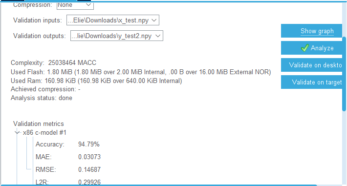
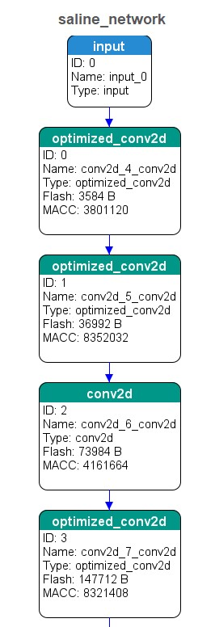
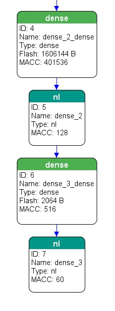

---
# Projet IA Embarqué
   ### Ayoub BELHOUARI & Elie DAHER
   #### 18-10-2022
---

# Introduction

Ce projet décrit l'implémentation d'un modèle de réseau de neurones basés sur la base de donnée Salinebottle sur une carte STM Discovery (STM32L4R9). Il contient l'archive du projet et les scripts python pour construire le modèle et communiquer avec la carte. 
L'objectif c'est de detecter le niveau de liquide (chloride de sodium) dans les boteilles pour la surveillance du niveau de remplissage avec une IA embarquée.

# Dataset

La dataset a été fournit par ST. Elle contient des photos des bouteilles prisent de differents angles et avec des niveaux de liquides differents reparties dans 4 dossiers differents (‘sal_data_100’, ‘sal_data_50’, ‘sal_data_80’, ‘sal_data_empty’).
Les données d'image, pour chaque niveau de remplissage de la bouteille, fournissent différentes perspectives, conditions d'éclairage, mise au point sur la bouteille, arrière-plan. Ces éléments sont utiles pour vérifier l'évidence visuelle du niveau de liquide salin à l'intérieur de la bouteille.
L'ensemble de données proposé consiste en une archive de 4217 images.


Le fichier [*Dataprocessing.ipynb*](Dataprocessing.ipynb) fourni dans le répertoire  est utile pour construire le pipeline logiciel qui opère sur l'ensemble de données. Ce pipeline manipule les images, construit les structures appropriées pour accueillir l'ensemble de données redimensionné et il redimensionne les images de 3456×3456 pixels de résolution à 64×64. Il convertit aussi les images à des vecteur "numpy array" pour l'entraînement . 
Ces données seront diviser en *train* et *test* sets avec lesquelles nous allons entrainer et tester le modèle (les fichiers X_org,Y_org et X_test,Y_test).
Ce code python transforme aussi les images en negative pour avoir de meilleurs detections de niveau.

L'augmentation des images est effectuée aussi avant la formation du réseau neuronal. La procédure agit sur certains paramètres tels que l'angle de rotation de 40°, le décalage en largeur de 0,2, le décalage en hauteur de 0,2, le *zoom* de 0,2 et le retournement horizontal autorisé. Il convient de noter que la classe ne renvoie que les images augmentées et non les images originales. Comme le nombre d'échantillons dans l'ensemble de données a augmenté, on s'attend à ce que le modèle puisse atteindre une meilleure précision dans des conditions de travail plus générales. 

# Modèle

Nous avons monté et entraîné un réseau de neurones convolutifs à l'aide de ce jeu de données afin de montrer un exemple des performances qui peuvent être atteintes. La précision et la perte obtenues sont également rapportées. 
Le fichier  [*model.ipynb*](model.ipynb) décrit les différentes étapes parcourus .

## Modèle V1
La structure du réseau est composée de 4 couches convolutionnelles 2D avec un filtre de taille 3×3 suivi d'une fonction d'activation *ReLu* avec l'utilisation du pooling max 2D avec une taille de pool 2×2 et des Dropouts. \
La figure ci-dessous illustre le résumé du modèle Keras avec le nombre de paramètres. Enfin dans la dernière couche, l'utilisation de la fonction d'activation *Softmax* est un choix judicieux pour classer les images d'entraînement, fournies en entrée, en 4 classes de niveau de remplissage. 

```
Model: "sequential_38"
_________________________________________________________________
 Layer (type)                Output Shape              Param #   
=================================================================
 conv2d_64 (Conv2D)          (None, 64, 64, 32)        896       
                                                                 
 conv2d_65 (Conv2D)          (None, 62, 62, 32)        9248      
                                                                 
 max_pooling2d_32 (MaxPoolin  (None, 31, 31, 32)       0         
 g2D)                                                            
                                                                 
 dropout_46 (Dropout)        (None, 31, 31, 32)        0         
                                                                 
 conv2d_66 (Conv2D)          (None, 31, 31, 64)        18496     
                                                                 
 conv2d_67 (Conv2D)          (None, 31, 31, 64)        36928     
                                                                 
 max_pooling2d_33 (MaxPoolin  (None, 15, 15, 64)       0         
 g2D)                                                            
                                                                 
 dropout_47 (Dropout)        (None, 15, 15, 64)        0         
                                                                 
 flatten_19 (Flatten)        (None, 14400)             0         
                                                                 
 dense_38 (Dense)            (None, 512)               7373312   
                                                                 
 dropout_48 (Dropout)        (None, 512)               0         
                                                                 
 dense_39 (Dense)            (None, 4)                 2052      
                                                                 
=================================================================
Total params: 7,440,932
Trainable params: 7,440,932
Non-trainable params: 0
```
L'accuracy est de **88.06%** avec un overfit comme le montre le graph de la figure ci-dessous:

<p align="center">
  
</p>

## Modèle V2
Afin d'améliorer l'accuracy de notre modèle, nous avons utilisé à la place du *Droupout* normal, Le *Spatial Dropout* car ce dernier, permet d'avoir des meilleures résultats avec les réseaux convolutifs. Nous avons aussi reduit le nombre d’entrèes après l’aplanissement du modele (*flatten*) de 512 à 128. La réduction du nombre de paramètres permet aussi de réduire la taille du modèle ce qui le rend de plus en plus embarquable sur le hardware .  

```
Model: "sequential_1"
_________________________________________________________________
 Layer (type)                Output Shape              Param #   
=================================================================
 conv2d_4 (Conv2D)           (None, 64, 64, 32)        896       
                                                                 
 max_pooling2d_3 (MaxPooling  (None, 32, 32, 32)       0         
 2D)                                                             
                                                                 
 conv2d_5 (Conv2D)           (None, 30, 30, 32)        9248      
                                                                 
 spatial_dropout2d_1 (Spatia  (None, 30, 30, 32)       0         
 lDropout2D)                                                     
                                                                 
 max_pooling2d_4 (MaxPooling  (None, 15, 15, 32)       0         
 2D)                                                             
                                                                 
 conv2d_6 (Conv2D)           (None, 15, 15, 64)        18496     
                                                                 
 conv2d_7 (Conv2D)           (None, 15, 15, 64)        36928     
                                                                 
 max_pooling2d_5 (MaxPooling  (None, 7, 7, 64)         0         
 2D)                                                             
                                                                 
 dropout_2 (Dropout)         (None, 7, 7, 64)          0         
                                                                 
 flatten_1 (Flatten)         (None, 3136)              0         
                                                                 
 dense_2 (Dense)             (None, 128)               401536    
                                                                 
 dropout_3 (Dropout)         (None, 128)               0         
                                                                 
 dense_3 (Dense)             (None, 4)                 516       
                                                                 
=================================================================
Total params: 467,620
Trainable params: 467,620
Non-trainable params: 0
_________________________________________________________________
Epoch 1/50
99/99 [==============================] - 23s 228ms/step - loss: 1.3891 - accuracy: 0.2533 - val_loss: 1.3853 - val_accuracy: 0.2474
Epoch 2/50
99/99 [==============================] - 25s 253ms/step - loss: 1.3842 - accuracy: 0.2720 - val_loss: 1.3845 - val_accuracy: 0.2844
Epoch 3/50
99/99 [==============================] - 23s 234ms/step - loss: 1.3182 - accuracy: 0.3624 - val_loss: 1.3109 - val_accuracy: 0.4076
.
.
Epoch 49/50
99/99 [==============================] - 23s 234ms/step - loss: 0.0602 - accuracy: 0.9801 - val_loss: 0.2776 - val_accuracy: 0.9355
Epoch 50/50
99/99 [==============================] - 23s 234ms/step - loss: 0.0473 - accuracy: 0.9836 - val_loss: 0.2151 - val_accuracy: 0.9479
```

L'accuracy a augmentée à **94.78** % . Le modéle est donc parfait puisqu'il n'ya pas d'overfitting.

<p align="center">
  
</p>

# Embarquer le modèle sur la carte STM32L4R9 
Jusqu'à maintenant nous avons notre modèle avec une accuracy de **94.78%**. Nous allons maintenant l'embarquer sur la carte.
Pour embarquer le modéle sur la carte STM32, nous avons sauvegarder le modèle sous format h5  [*model.h5*](model.h5) ainsi que les images et les labels.([*x_test*](x_test.npy) et  [*y_test*](y_test.npy)).\

Sur *STMCubeIDE* , nous avons on créé notre network **"saline_network"**. 
L'analyse notre modèle donne les résultats indiqués dans la figure ci-dessous:

<p align="center">
  
</p>

Nous remarquons que le modèle utilise **1.80MiB/2.00 MiB** de la mémoire flash et **160.98 KiB/640.00 KiB** de la RAM Ce qui montre que notre modèle est emarquable sur la carte sans aucune problème c'est-è-dire sans compression ni pruning!\
Ensuite,Le boutton **Validate on desktop** nous permet de voir l'accuracy de notre modèle qui est **94.79%**.\
Les deux figures ci-dessous montrent le graphique de notre modèle sur la carte.

<p align="center">
  
  
</p>

# Tester le Modèle sur la STM32

## Main.c
Dans ce fichier, il faut juste blocker l'initialisation du port usb_otg et le SDMCC1 pour ne pas blocker le fonctionnement de L'UART2. La boucle principale de ce fichier appelle  la fonction **MX_X_CUBE_AI_Process()** en permanence.
## App_x-cube-ai.c
Dans ce fichier, se trouve tout le code principale pour tourner les inférences sur la carte et c'est là où il faut modifier le code pour qu'il puisse acquérir les données et les envoyés vers l'entrée du réseau de neurones.
D'abord, il faut declarer notre *HandlerTypeDef* pour le UART2 (*huart2*).\
Après, il y a les 4 fonctions principales: *MX_X_CUBE_AI_Process( )*, *acquire_and_process_data(in_data[ ])*, *ai_run()* et *post_process(out_data[ ])*.

### MX_X_CUBE_AI_Process( )

C'est la fonction appelée dans le main et c'est elle qui  gére le code pour faire tourner le modèle.\
Il faut déclare d'abord les buffers pour les données d'entrées et sorties:
``` 
  uint8_t *in_data = NULL;
  uint8_t *out_data = NULL;
```
Ensuite, on gère la syncronisation entre le fichier python [*communication_py.ipynb*](communication_py.ipynb) et la STM32 en attendant le message "sync" et puis en renvoyant un ack de valeur "101".\
Suite à la syncronisation, on lance la fonction *acquire_and_process_data(in_data[ ])*. Après, la fonction *ai_run()* lance le modèle, et enfin, envoyer le résultat via le UART2 au scripte python avec la fonction *post_process(out_data[ ])*.

### -acquire_and_process_data(in_data[])

Cette fonction est responsable de traiter les données: Il récupére  l'image du huart2 dans le même ordre utilisé pour l'envoyer avec le scripte python c'est-à-dire on envoie les 64x64 pixels de chaque layer de couleur (puisqu'on travaille avec des images couleurs).\
Après, il faut linéariser cette immage dans le tableau *data[]* en divisant chaque pixel de 32 bits(*uint32_t*) sur 4 variables de *uint8_t*.\
En testant le modèle sur la carte, on a constaté qu'il faut linéariser l'image en stockant, pour chaque pixel, les valeurs des 3 layers successivement, puis ligne par ligne.Ceci est fait avec la boucle suivante : 
```
for (z=0; z<3;z++){
		for (i = 0; i < 64; i++){
			for (j = 0; j < 64; j++){
				HAL_UART_Receive(&huart2, (uint8_t *) tmp, sizeof(tmp), 100);
				input[i][j][z] = *(float*) &tmp;
				for ( k = 0; k < 4; k++){
					// Linearise the image and divid it in a 8bit buffer.
					((uint8_t *) data)[((i*192+j*3+z)*4)+k] = tmp[k];
					//test_data[((i*64+j*64+z)*4)+k] = tmp[k];
				}
			}
		}
	}
```

### -ai_run()
Cette fonction passe les données traitées à notre *saline_network* et il retourn sa prediction.

### -post_process(out_data[])
Quand le modèle termine son inférence, on va stocker sa sortie dans un tableau de dimension 4 contenant des probabilitées pour chaque classe de résolution *float*. Ces probabilitées seront chargées de la sortie du modèle chacune sur 4 buffer de *uint8_t* et puis linéarisées dans le tableau précédant (*prob_classes[4]*).\
Après, on envoie sur l'uart "010" pour notifier le scripte python qu'on a terminé, puis envoyer notre résultat (octet par octet) sur l'uart.\
Ainsi, l'inférence est terminée!.\
*On a due ajouter un délais à la fin de ce process pour pouvoir récupérer les résultats à la fin de l'inférence avant de répéter le process de nouveau. (On a constaté ce problème en mettant un point d'arrêt avec le mode debug de STM32CubeIDE)*

## Envoie et réception des images via UART
L'envoie des données se fait avec le fichier [*communication_py.ipynb*](communication_py.ipynb). Dans ce fichier,nous avons créé notre modèle, les *x_test* et *y_test*. Puis, nous avons choisi une image aléatoire et l'afficher avec son label, et après la syncronisation avec la carte STM32, envoyè cette même image pour que notre modèle la traite. Le format des images envoyées est *(64, 64, 3)*. après nous avons envoyè les 64x64 pixels de chacunes des 3 layers de couleurs.
Dans le fichier de communication,nous avons utilisé cette boucle pour envoyer tous les pixels de l'image:
```
# rgb processing
        for k in range(3):
            for i in range(64):
                for j in range(64):
                    ser.write(tmp[i,j,k])

        input_sent = True
```
Quand le modèle termine son inférence, il nous renvoie son résultat et on la compare avec le label pour voir la performence de notre modèle.
On constate que la prédiction du modèle embarqué correspond aux labels de chaque image.

<p align="center">
  
  
</p>

## Exemple d'attaque utilisant FGSM : 

Afin de tester la sécurité et l'intégrité de notre modéle nous avons appliquée un exemple d’attaque contradictoire à l’aide de l’attaque Fast Gradient Signed Method (FGSM).
La méthode du signe de gradient rapide fonctionne en utilisant les gradients du réseau de neurones pour créer un exemple contradictoire.  

<p align="center">
  
</p>

La prédiction avant l’attaque était 2 c'est-à-dire la bouteille est à 80 %. Mais on appliquons différentes valeurs de epsilons, et là, la prédiction change et le modèle se trompe .Le modèle résiste aux attaques avec des eps < 0.7 mais au delà de cette valeur il se trompe (En considérant que pour ces valeurs d'epsilon l'image n'est plus claire pour une personne). Cela vient comme un compromis qui fait que les perturbations deviennent plus identifiables. Cela est dû peut-être à la taille de l’image qui est petite donc il faut utiliser des grandes valeurs de eps pour que le modèle identifie la différence.

<p align="center">
  
</p>

## Attaquer le modéle sur la carte STM32 : 

Après avoir appliquer des attaques sur le modèle maintenant nous allons tester la résistance de la carte aux attaques,qui, normalement devrait être la même que notre modèle.

Nous avons sauvegardé les images de l'attaque précédente pour les différents epsilons sous forme d'un "numpy array" et nous avons modifier le script de communication en un nouveau scripte  [*communication_Attack.ipynb*](communication_Attack.ipynb) où on envoi à la carte cette photo avec les différents valeurs de epsilons et nous avons eu les résultats ci-dessous:

| epsilon: 0.06  | epsilon: 0.2    |
|:--------------:|:---------------:|
|
| epsilon: 0.8   | epsilon: 0.9    |
|

On peut voir qu'on obtient le même resultat que précédemment. 


# Conclusion
Nous vons réussi à élaborer un modèle  fonctionnel en partant juste de la dataset et de l'embarquer sur la carte STM Discovery (STM32L4R9). Ce modèle résiste aux attaques FGSM (avec un epsilon<0.7).Nous avons rencontré des difficultés pour communiquer la carte avec le code python mais à la fin le problème est résolu.
On a pas pu lancer plusieurs inférences à la foie c'est-à-dire tester plusieurs images à la fois,Le problème c'est que pour la nouvelle inférence, le scripte re-synchronise avec la carte mais  la carte se bloque et on ne reçoit plus l'informations.
Ce projet pourra avoir des améliorations dans le future comme la prédiction des images entrés depuis l'écran tactile de la carte *STM32L4R9*.
En fin , nous somme contents des résultats malgrés les différentes difficultés et contraintes du projet .


# Outils requis 

Afin d'utiliser le projet, les outils suivants sont nécessaires :

- STM32CubeIDE v1.6.0
- IDE Python (comme jupyter notebook) avec python v3.10 (important)
- STM32L4R9 Discovery board 
- USB cable to connect board to computer

# Documentation
Software:
- STM32CubeMX:  https://www.st.com/en/development-tools/stm32cubemx.html#documentation
- Cube-MX-AI:   https://www.st.com/en/embedded-software/x-cube-ai.html#documentation
- STM32CubeIDE: https://www.st.com/en/development-tools/stm32cubeide.html#documentation
 
Courses :
- Embedded Neural Network on MCU by mr *O.POTIN* 

-Dataset : 
- [Saline Bottle dataset](https://data.mendeley.com/datasets/9mcj3rvvxb/2)
## Version
**Actual version:** 1


